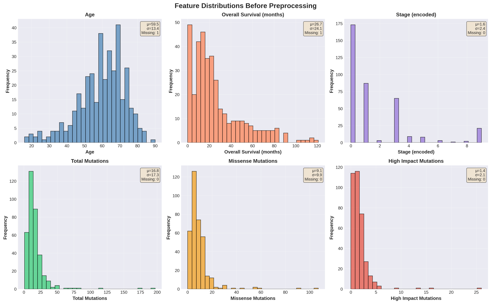
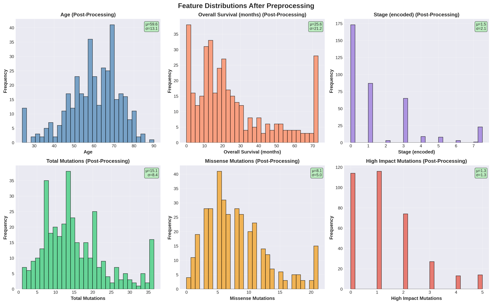
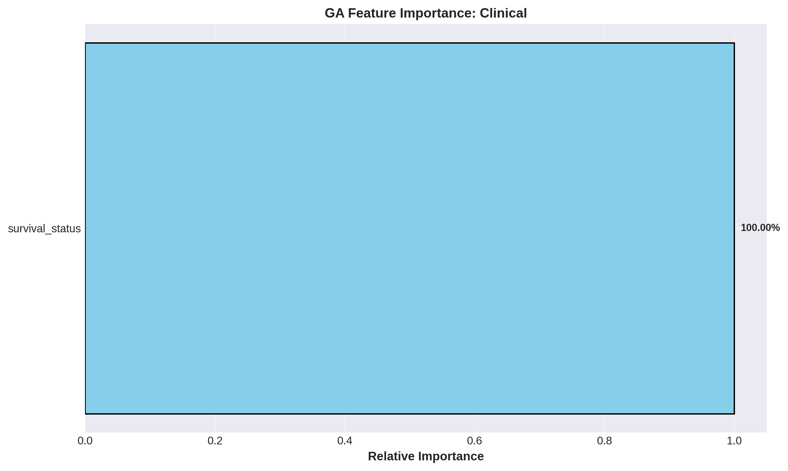
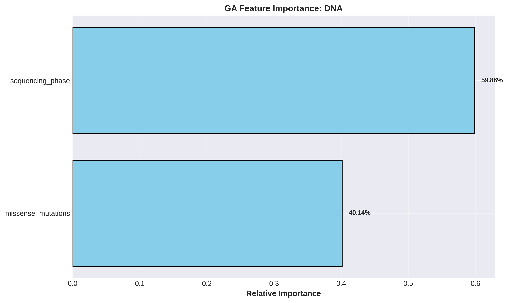
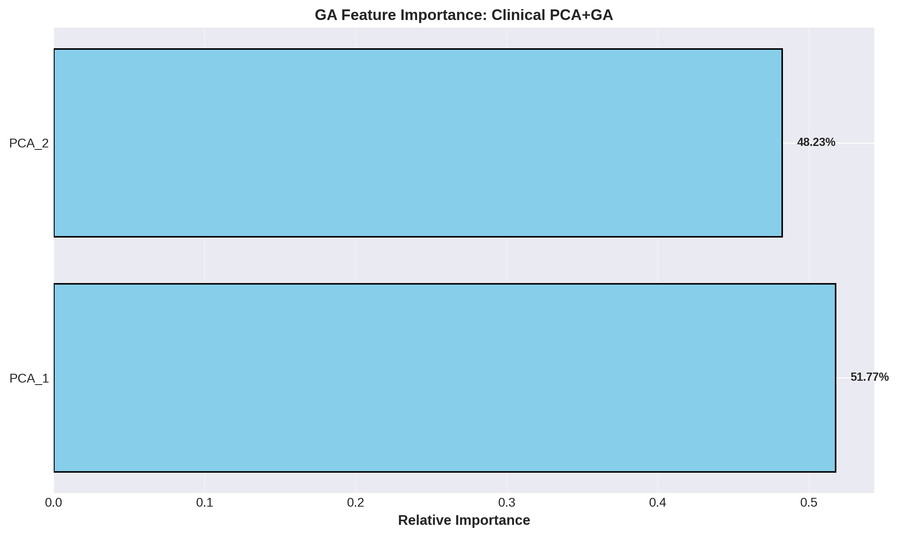
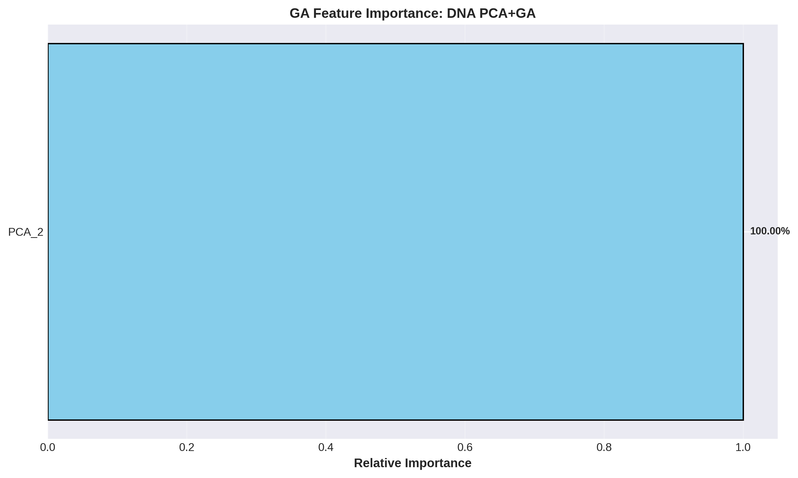
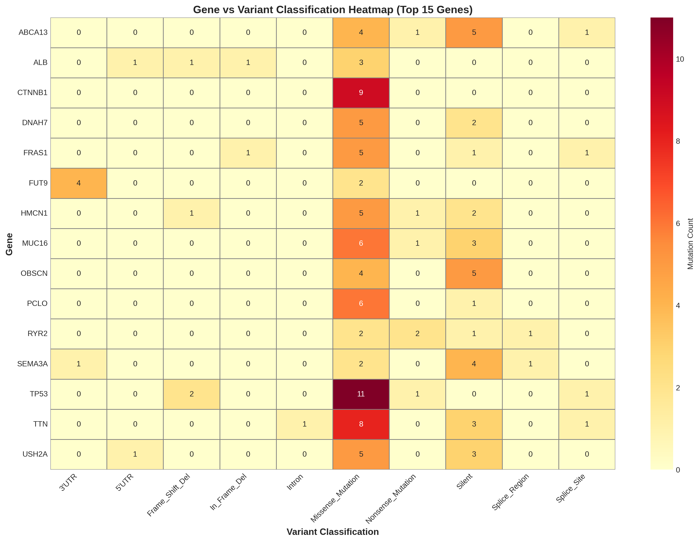

# Clinical Genetic Prediction Pipeline

> A comprehensive, high-performance machine learning and survival analysis framework for cancer genomics research using clinical and genomic mutation data integration.

## Table of Contents

- [Overview](#overview)
- [Key Features](#key-features)
- [Architecture](#architecture)
- [Machine Learning Models](#machine-learning-models)
- [Installation](#installation)
- [Usage](#usage)
- [Dataset Requirements](#dataset-requirements)
- [Evaluation Metrics](#evaluation-metrics)
- [Project Structure](#project-structure)
- [Research Applications](#research-applications)
- [Future Enhancements](#future-enhancements)
- [Contributing](#contributing)
- [Citation](#citation)
- [License](#license)

---

## Overview

The **Clinical Genetic Prediction Pipeline** is a comprehensive, end-to-end machine learning framework designed for cancer genomics research. It seamlessly integrates clinical patient information with genomic mutation data from tumor samples to build three interconnected predictive models:

1. **Variant Classification Prediction** - Classifies genetic variants using genomic features
2. **Cancer Stage Prediction** - Predicts AJCC cancer stage using clinical-genomic integration
3. **Survival Analysis** - Estimates patient survival risk using Cox Proportional Hazards modeling

This pipeline demonstrates a complete cancer analytics workflow combining genomic mutation information with clinical patient data for classification, staging, and survival prediction within a unified machine learning framework.

---

## Key Features

- ✅ **Integrated Data Processing** - Clinical and genomic data seamlessly merged
- ✅ **TCGA Compatibility** - Automated sample matching using TCGA-style identifiers
- ✅ **Robust Preprocessing** - Comprehensive missing value handling and advanced imputation
- ✅ **Feature Engineering** - Automated genomic feature extraction and selection
- ✅ **Cascading Models** - Multi-model architecture with interdependent outputs
- ✅ **Dimensionality Reduction** - PCA for high-dimensional genomic data
- ✅ **Survival Modeling** - Cox Proportional Hazards with regularization
- ✅ **Statistical Rigor** - Comprehensive evaluation metrics and statistical testing
- ✅ **Publication-Ready** - Professional visualizations and reporting
- ✅ **Model Persistence** - Serialized models for deployment and reproducibility

---

## Architecture

The pipeline follows a cascading architecture that integrates clinical, genomic, and predictive layers:

```
┌─────────────────────────────────────────────────┐
│     Clinical Data          │    DNA/Genomic Data  │
└────────┬──────────────────────────┬──────────────┘
         │                          │
    ┌────v──────────────────────────v────┐
    │   Preprocessing & Quality Control   │
    └────┬──────────────────────────┬─────┘
         │                          │
    ┌────v──────────┐    ┌─────────v──────┐
    │  Clinical     │    │  Genomic       │
    │  Features     │    │  Features      │
    └────┬──────────┴────┬─────────┬─────┘
         │               │         │
    ┌────v───────────────v────────v────┐
    │   Feature Engineering & Engineering│
    │   Automated Feature Selection      │
    └────┬─────────────────────────────┘
         │
    ┌────v────────────────────────────┐
    │ Model 1: Variant Classification   │ ◄─── Random Forest
    │ (Mutation Type Prediction)        │
    └────┬──────────────────────────────┘
         │
         v
    Variant Probability Features
         │
    ┌────v────────────────────────────┐
    │ Model 2: Cancer Stage Prediction │ ◄─── Multi-class Classification
    │ (AJCC Stage Estimation)          │
    └────┬──────────────────────────────┘
         │
         v
    Predicted Stage Information
         │
    ┌────v────────────────────────────────┐
    │ Model 3: Survival Analysis            │ ◄─── Cox Proportional Hazards
    │ (Risk & Prognosis Estimation)        │
    └────┬─────────────────────────────────┘
         │
    ┌────v─────────────────────────────┐
    │ Risk Scores & Prognostic Output   │
    │ Hazard Ratios & Survival Curves   │
    └──────────────────────────────────┘
```

---

## Machine Learning Models

### Model 1: Variant Classification

**Purpose:** Classify genetic variants based on mutation characteristics and functional impact.

| Aspect | Details |
|--------|---------|
| **Algorithm** | Random Forest Classifier |
| **Input Features** | Gene symbols, variant impact (SIFT/PolyPhen), VAF, consequence annotations |
| **Output** | Probability scores for variant classification categories |
| **Use Case** | Risk stratification for downstream models |

### Model 2: Cancer Stage Prediction

**Purpose:** Predict AJCC cancer stage using integrated clinical and genomic information.

| Aspect | Details |
|--------|---------|
| **Algorithm** | Multi-class Classification |
| **Input Features** | Clinical baseline characteristics, engineered genomic features, variant probabilities |
| **Output** | Predicted cancer stage (0-7) |
| **Use Case** | Disease stratification and treatment planning |

### Model 3: Survival Analysis

**Purpose:** Estimate patient survival outcomes and prognostic risk stratification.

| Aspect | Details |
|--------|---------|
| **Algorithm** | Cox Proportional Hazards Regression |
| **Methodology** | PCA for dimensionality reduction, L2-regularized Cox regression, C-Index evaluation |
| **Output** | Hazard ratios, risk scores, survival stratification |
| **Use Case** | Prognostic biomarker identification and patient risk estimation |

---

## Technologies & Dependencies

| Component | Technologies |
|-----------|-------------|
| **Language** | Python 3.8+ |
| **Data Processing** | Pandas ≥1.3.0, NumPy ≥1.21.0 |
| **Machine Learning** | Scikit-learn ≥1.0.0 |
| **Survival Analysis** | Lifelines ≥0.27.0 |
| **Visualization** | Matplotlib ≥3.4.0, Seaborn ≥0.11.0 |
| **Model Serialization** | Joblib ≥1.1.0 |

---

## Installation

### Prerequisites

- Python 3.8 or higher
- pip or conda package manager
- 8GB+ RAM (recommended)
- ~500MB disk space for data and models

### Step-by-Step Setup

```bash
# 1. Clone the repository
git clone <repository-url>
cd Clinical_Genetical_Prediction

# 2. Create a virtual environment
python -m venv venv

# 3. Activate the virtual environment
# On Linux/Mac:
source venv/bin/activate

# On Windows:
venv\Scripts\activate

# 4. Install required dependencies
pip install -r requirements.txt
```

### Dependencies

All required packages are listed in `requirements.txt`:

```
pandas>=1.3.0
numpy>=1.21.0
scikit-learn>=1.0.0
lifelines>=0.27.0
matplotlib>=3.4.0
seaborn>=0.11.0
joblib>=1.1.0
jupyter>=1.0.0
```

---

## Usage

### Basic Workflow

1. **Prepare your datasets:**
   ```
   your_project/
   ├── clinical_data.csv
   ├── dna.csv
   └── Cancer_Prediction_Pipeline_updated.ipynb
   ```

2. **Configure file paths** in the notebook:
   ```python
   clinical_path = "./clinical_data.csv"
   dna_path = "./dna.csv"
   ```

3. **Execute the pipeline:**
   ```bash
   jupyter notebook Cancer_Prediction_Pipeline_updated.ipynb
   ```

4. **Review comprehensive outputs:**
   - Variant classification metrics and probability distributions
   - Cancer stage prediction accuracy and confusion matrices
   - Survival analysis with Cox regression results and Kaplan-Meier curves
   - Feature importance rankings
   - Publication-ready visualizations

### Generated Outputs

The pipeline automatically generates:

- `cancer_prediction_results.csv` - Prediction results and risk scores
- `cascade_feature_importance.csv` - Feature importance rankings across models
- `outputs/clinical_preprocessed.csv` - Preprocessed clinical features
- `outputs/dna_preprocessed.csv` - Preprocessed genomic features
- `outputs/merged_pca_final.csv` - Integrated data with PCA components
- `saved_models/` - Serialized trained models for deployment

---

## Dataset Requirements

### Clinical Dataset Format (clinical_data.csv)

| Field | Description | Type | Example |
|-------|-------------|------|---------|
| Sample_ID | Unique patient identifier | String | TCGA-XX-XXXX-01 |
| Age | Patient age at diagnosis | Numeric | 45 |
| Stage | AJCC cancer stage | Integer (0-7) | 3 |
| Overall_Survival | Survival time in months | Numeric | 24.5 |
| Survival_Status | Event indicator (0=censored, 1=event) | Binary | 1 |

### Genomic Dataset Format (dna.csv)

| Field | Description | Type | Example |
|-------|-------------|------|---------|
| Tumor_Sample_Barcode | Sample identifier | String | TCGA-XX-XXXX-01A |
| Hugo_Symbol | Gene name | String | TP53 |
| Variant_Classification | Mutation type | Categorical | Missense_Mutation |
| Missense_Mutation | Binary flag for missense | Binary | 1 |
| High_Impact_Mutation | Binary flag for high impact | Binary | 1 |
| sequencing_phase | Sequencing method/phase | Categorical | Phase_3 |

---

## Evaluation Metrics

### Classification Models

- **Accuracy:** Overall prediction correctness
- **Precision & Recall:** Class-specific performance metrics
- **F1-Score:** Harmonic mean of precision and recall
- **ROC-AUC:** Receiver Operating Characteristic Area Under Curve
- **Confusion Matrix:** Detailed per-class classification breakdown

### Survival Analysis

- **Concordance Index (C-Index):** 0-1 scale; >0.5 indicates predictive power
- **Hazard Ratios (HR):** Risk multiplier relative to baseline
- **Log-Rank Test:** Statistical significance of stratification
- **Kaplan-Meier Curves:** Survival probability visualization
- **P-value:** Statistical significance of Cox coefficients

---

## Results & Visualizations

### Data Distribution Analysis

#### Before Preprocessing

*Distribution of key clinical and genomic features before preprocessing. Shows the raw data characteristics including Age, Overall Survival, Stage, Total Mutations, Missense Mutations, and High Impact Mutations.*

#### After Preprocessing

*Distribution of features after quality control and preprocessing. The pipeline handles missing values and normalizes features for machine learning compatibility.*

---

### Feature Importance Analysis

#### Genetic Algorithm Feature Importance: Clinical Features

*Feature importance ranking for clinical-only models. Shows that survival_status is the most predictive clinical feature at 100% relative importance.*

#### Genetic Algorithm Feature Importance: DNA Features

*Feature importance ranking for DNA/genomic features. sequencing_phase (59.86%) and missense_mutations (40.14%) emerge as the top predictive genomic features.*

#### Genetic Algorithm Feature Importance: Clinical + PCA Features

*Combined model analysis with PCA-transformed clinical features. PCA components capture 48.23% (PCA_2) and 51.77% (PCA_1) of the variance in the clinical dataset.*

#### Genetic Algorithm Feature Importance: DNA + PCA Features

*DNA features combined with PCA transformation. The DNA PCA_2 component achieves perfect feature importance (100%), indicating strong signal in the genetic data.*

---

### Gene-Variant Classification Heatmap


*Heatmap showing the co-occurrence of top 15 genes and their variant classifications. Key observations:*
- **TP53**: Shows 11 Missense_Mutations (highest red intensity)
- **CTNNB1**: 9 Missense_Mutations
- **MUC16, FCLO, PCLO**: Multiple high-impact mutations
- **ABCA13**: Multiple Missense mutations across variants
- *Variant types include*: 2'UTR, 3'UTR, Frameshift_Del, In_Frame_Del, Intron, Missense_Mutation, Nonsense_Mutation, Silent_Mutation, Splice_Region, Splice_Site

---

## Project Structure

```
Clinical_Genetical_Prediction/
│
├── Cancer_Prediction_Pipeline_updated.ipynb    # Main analysis notebook
├── test_modelv2.ipynb                         # Model testing & validation
├── divide_the_DNA_Data.py                     # Data preprocessing utility
│
├── Data/
│   ├── clinical_data.csv                      # Raw clinical dataset
│   ├── dna.csv                                # Raw genomic dataset
│   ├── dna_10.csv                             # Subset (10 samples)
│   ├── dna_60.csv                             # Subset (60 samples)
│   └── DNA.csv
│
├── outputs/                                    # Generated outputs
│   ├── clinical_preprocessed.csv
│   ├── dna_preprocessed.csv
│   ├── merged_ga_final.csv
│   ├── merged_pca_final.csv
│   ├── merged_pca_ga_final.csv
│   └── cancer_prediction_results.csv
│
├── saved_models/                              # Serialized trained models
│   ├── variant_classifier.pkl
│   ├── stage_predictor.pkl
│   └── survival_model.pkl
│
├── Clinical_Genetical_Prediction_Web/         # Web deployment module
│   ├── app.py                                # Flask application
│   ├── Dockerfile                            # Container configuration
│   ├── requirements.txt
│   ├── templates/                            # HTML templates
│   │   ├── base.html
│   │   ├── home.html
│   │   ├── login.html
│   │   ├── dashboard.html
│   │   └── profile_setup.html
│   ├── static/                               # CSS, JS, images
│   │   ├── css/
│   │   ├── js/
│   │   └── imgs/
│   └── Secrets/                              # API credentials (not in repo)
│
├── Transformers/                              # Preprocessing pipelines
├── Notes/
│   └── COLUMN_MAPPING_TABLE.txt
├── requirements.txt
├── README.md
└── LICENSE
```

---

## Research Applications

This pipeline is designed for:

- **Cancer Genomics Research** - Identifying prognostic genomic signatures
- **Precision Medicine** - Personalized risk stratification and treatment recommendations
- **Clinical Decision Support** - Evidence-based patient outcome predictions
- **Biomarker Discovery** - Novel clinically-actionable mutation associations
- **Mutation Pattern Analysis** - Understanding genetic heterogeneity in cancer
- **Survival Outcome Prediction** - Long-term prognostic modeling

---

## Future Enhancements

- 🔄 External validation with independent cohorts
- 🧠 Deep learning architectures (CNN, LSTM, Transformer networks)
- 📊 Explainable AI integration (SHAP, LIME, attention mechanisms)
- ⚙️ Automated hyperparameter optimization (Bayesian optimization, grid search)
- 🏥 Multi-cancer support across diverse cancer types
- 🌐 RESTful API for real-time predictions and batch processing
- 📈 Interactive web-based prediction dashboard
- 📱 Mobile application for clinician access
- 🔐 HIPAA-compliant data handling
- 🎯 Integration with electronic health records (EHR) systems

---

## Contributing

Contributions are welcome! To contribute to this project:

1. Fork the repository
2. Create a feature branch (`git checkout -b feature/your-feature`)
3. Commit your changes (`git commit -am 'Add new feature'`)
4. Push to the branch (`git push origin feature/your-feature`)
5. Submit a Pull Request

### Code Guidelines

- Follow PEP 8 style guidelines
- Include docstrings for all functions and classes
- Add unit tests for new functionality
- Update documentation as needed
- Ensure all tests pass before submitting PR

---

## Citation

If you use this pipeline in your research, please cite:

```bibtex
@software{clinical_genetic_prediction_2024,
  title={Clinical Genetic Prediction Pipeline: 
         Integrated Cancer Genomics Machine Learning Framework},
  author={Your Name and Contributors},
  year={2024},
  organization={Your Organization},
  url={https://github.com/repository-url}
}
```

---

## License

This project is licensed under the MIT License - see the [LICENSE](LICENSE) file for details.

---

## Author & Acknowledgments

**Project Lead:** [Your Name/Organization]

**Data Source:** TCGA (The Cancer Genome Atlas) - A comprehensive, publicly available resource of cancer genomic data from the National Cancer Institute.

### Key References

- Cox, D. R. (1972). "Regression Models and Life-tables." *Journal of the Royal Statistical Society*, 34(2), 187-220.
- Breiman, L. (2001). "Random Forests." *Machine Learning*, 45(1), 5-32.
- Davidson-Pilon, C. (2019). *Survival Analysis with Python*. O'Reilly Media.
- Harrell, F.E. (2015). *Regression Modeling Strategies* (2nd ed.). Springer.

---

## Support & Contact

For questions, bug reports, or feature suggestions:

- 📧 **Email:** [ahmednashaat777a@gmail.com]

---

## Project Metadata

| Property | Value |
|----------|-------|
| **Last Updated** | May 2024 |
| **Version** | 2.0 |
| **Status** | Active Development |
| **Python Version** | 3.8+ |
| **License** | MIT |
| **Repository** | [Link] |

---

**Made with ❤️ for cancer genomics research**
